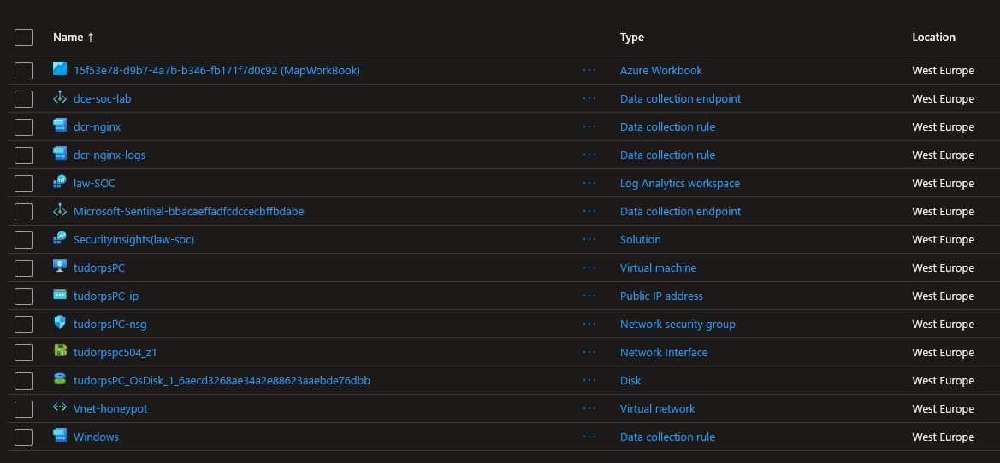
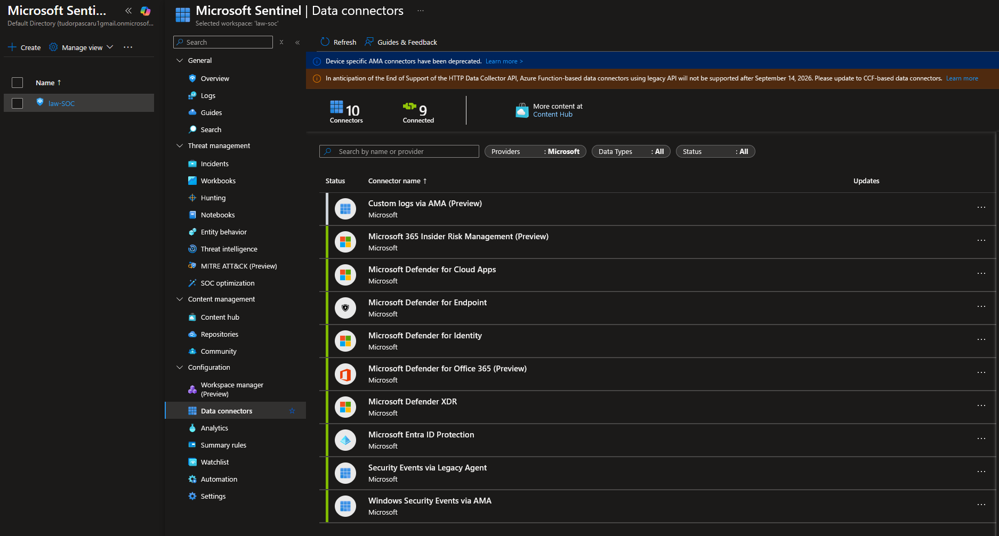
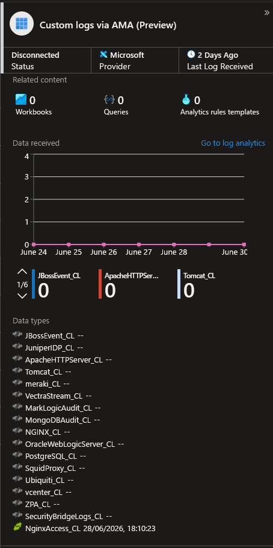
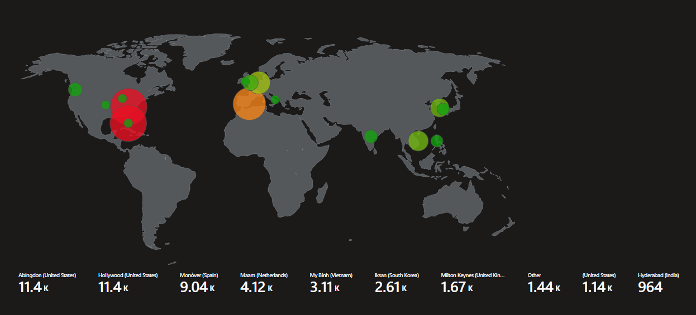

# SOC Home Lab with Microsoft Sentinel & OWASP JuiceShop

A cybersecurity home lab built on Azure to detect and analyze cyber attacks
using Microsoft Sentinel as a SIEM.

---

## Architecture

```
Kali Linux (attacker)
        |
        v
    Nginx 1.24.0 (reverse proxy, port 80)
        |
        v
OWASP JuiceShop (Docker, port 3000)
        |
        v
Azure Monitor Agent (AMA)
        |
        v
Log Analytics Workspace (law-soc)
        |
        v
Microsoft Sentinel (SIEM)
```
## Infrastructure Screenshots

**Resource Group Azure Portal**


*All Azure resources deployed for the lab: VM, NSG, Log Analytics Workspace, Sentinel*

**Microsoft Sentinel Overview**


*Sentinel dashboard showing connected data connectors*

**Data Connectors**



**Azure Components:**

| Component | Details |
|---|---|
| Cloud | Microsoft Azure, West Europe |
| VM | Windows 10, tudorpsPC |
| SIEM | Microsoft Sentinel |
| Log Analytics | law-soc |
| Vulnerable Application | OWASP JuiceShop (Docker) |
| Proxy / Logging | Nginx 1.24.0 |
| Log Ingestion | Azure Monitor Agent + Custom DCR |
| Attacker Machine | Kali Linux |

---

## Phase 1: Passive Honeypot (Real-World Data)

The VM was intentionally exposed to the internet with all ports open
to collect real-world attack data.

**Results collected in 24h:**

| Metric | Value |
|---|---|
| Total events | 28,300+ SecurityEvents |
| Attacking countries | 9 (USA, UK, Vietnam, South Korea, Netherlands, Spain, India, others) |
| Top source | Hollywood & Abingdon (United States), 11.4k events each |
| Predominant attack type | RDP Brute Force (EventID 4625) |

**Attack map:**


*Real-world attack map collected during 24h of internet exposure*

---

## Phase 2: Simulated Attacks & Detection

Controlled attacks simulated against OWASP JuiceShop, detected and
analyzed in Microsoft Sentinel using KQL.

**Documented attacks:**

| Attack | Status | OWASP | MITRE ATT&CK |
|---|---|---|---|
| SQL Injection | Complete | A03:2021 - Injection | T1190 |
| XSS | Planned | A03:2021 - Injection | T1059.007 |
| Directory Traversal | Planned | A01:2021 - Broken Access | T1083 |

Each attack is documented in `/attacks/` with:
- Step-by-step execution and commands used
- Attack screenshots and results
- KQL detection query
- Detection analysis in Sentinel

---

## Detection in Sentinel

HTTP logs are collected through:

```
Nginx access.log
    → Azure Monitor Agent (Custom Text Log DCR)
    → NginxAccess_CL (Log Analytics Workspace)
    → Microsoft Sentinel
```

## Repository Structure

```
soc-home-lab/
├── README.md
├── attacks/
│   ├── sql_injection.md
│   ├── XSS.md
│   ├── path_traversal.md
│   
└── screenshots/
    ├── attack_map.png
    ├── azure_architecture.png
    ├── sentinel_overview.png
    .
    .
    .
     
```

---

## Technologies Used

- Microsoft Azure (VM, NSG, Log Analytics, Sentinel, AMA, DCR)
- Microsoft Sentinel (SIEM, Analytics Rules, Workbooks, Watchlists)
- KQL (Kusto Query Language)
- OWASP JuiceShop (Docker)
- Nginx 1.24.0
- Kali Linux (SQLmap, Burp Suite, ffuf)

---

## Status

Work in Progress
